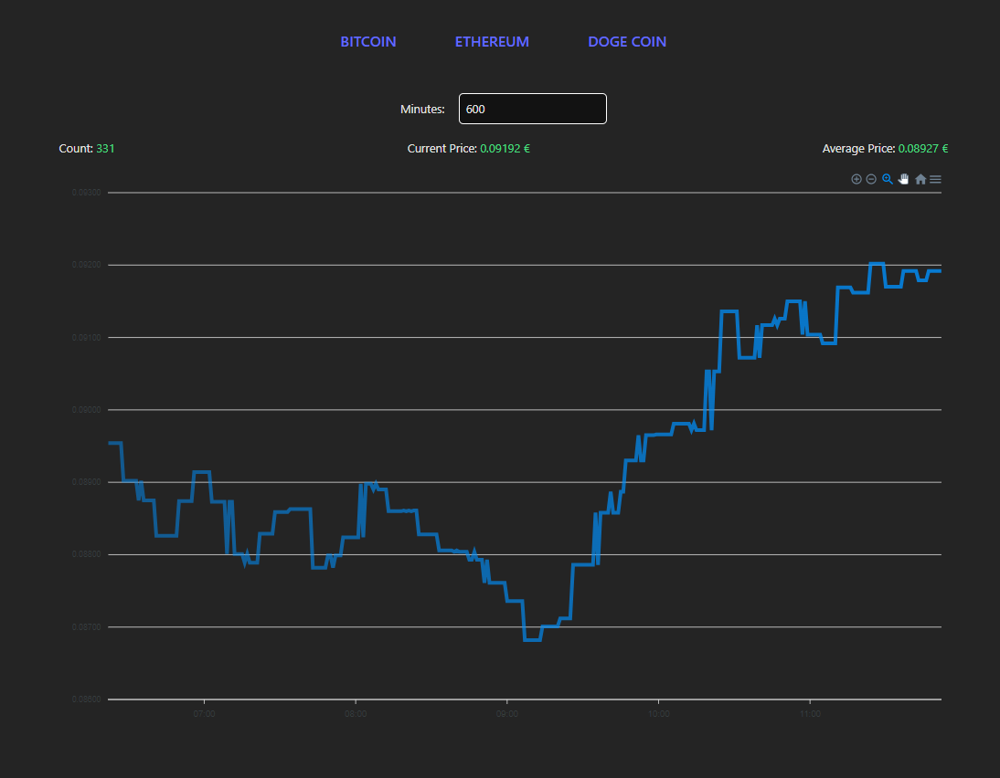

# Crypto Price Tracker

This project is a web application that tracks the prices of the cryptocurrencies Bitcoin (BTC), Ethereum (ETH), and Dogecoin (DOGE). It consists of a backend built with Node.js and TypeScript, and a frontend built with React and TypeScript. The project fetches the latest prices from the Coingecko API every 60 seconds and stores the price history in-memory. The frontend displays the latest and average prices and provides a historical view of the price data.

## How it looks



## Features

### Backend

- Fetches prices in EUR of the cryptocurrencies Bitcoin, Ethereum, and Dogecoin every 60 seconds from the Coingecko API.
- Stores the price history in-memory.
- Provides an endpoint to request information about a symbol with an optional parameter for the number of minutes to include in the response.
- Configurable server port via environment variable.
- Runnable via `npm start`.

### Frontend

- Fetches data from the backend every 60 seconds and updates the UI accordingly.
- Includes a custom React hook to fetch the data, with symbol and number of minutes requested as parameters.
- Provides navigation to switch between BTC, ETH, and DOGE.
- Displays the latest and average price of the currently active symbol.
- Provides a historical view of the price data.

## Installation and Setup

### Prerequisites

- Node.js (>= 18.x)
- pnpm

### Clone the Repository

```sh
git clone git@github.com:mindfulMachineLath/crypto-price-tracker.git
```

### Install Dependencies

```sh
pnpm install
```

### Backend Configuration

Create a .env file in the apps/backend directory with the following content:

```sh
COINGECKO_API_URL=https://api.coingecko.com/api/v3/simple/price
COINGECKO_API_KEY=your_api_key
COINGECKO_FETCH_INTERVAL_TIME=60000
PORT=3000
```

### Start the Backend

```sh
cd apps/backend
pnpm start
```

### Frontend Configuration

Create a .env file in the apps/frontend directory with the following content:

```sh
VITE_BACKEND_URL=http://localhost:3000
VITE_REFETCH_INTERVAL=60000
VITE_DEFAULT_MINUTES=60
```

### Start the Frontend

```sh
cd apps/backend
pnpm run dev
```

### Start Frontend and Backend.

Run both of the Frontend and Backend at the same time with the following command at the root directory:

```sh
pnpm run dev
```

## Useage

- Open your browser and navigate to http://localhost:5173.
- Use the navigation to switch between BTC, ETH, and DOGE.
- View the latest and average prices, as well as the historical price data.
